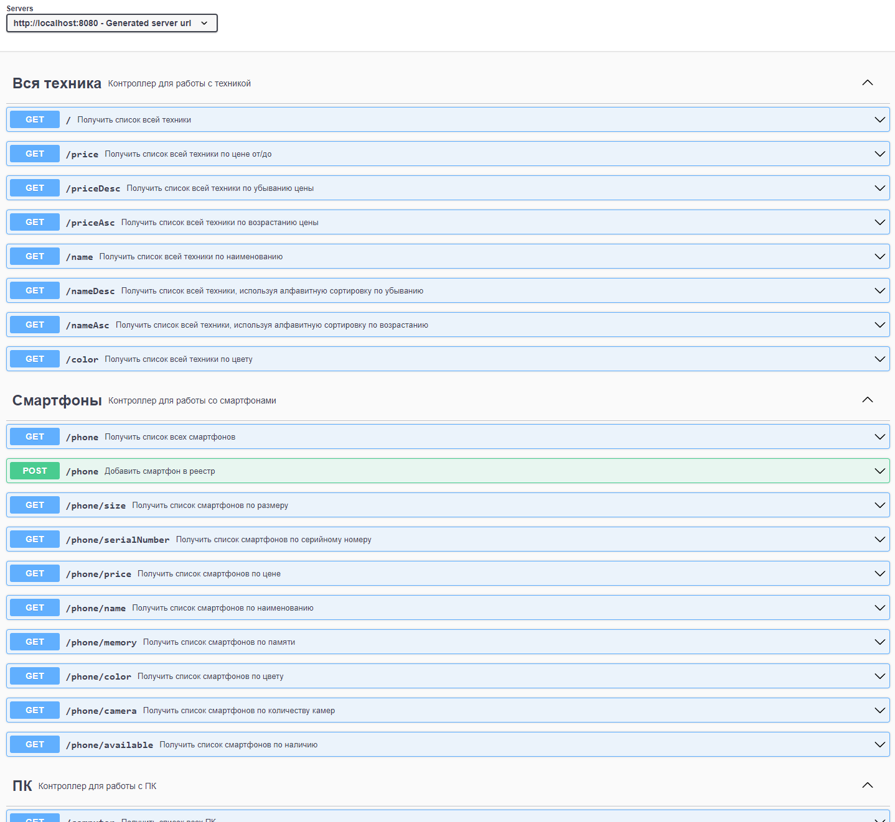

# Реестр техники

## Описание проекта

* RESTful веб-сервис, представляющий реестр видов техники с привязкой к моделям, которые имеют собственные характеристики.
* По выделенным атрибутам реализован поиск по наименованию, вне зависимости от регистра, а также фильтрация по виду техники, цвету, цене (от/до).
* Остальные фильтры зависят от выбора вида техники и выполняют фильтрацию по атрибутам моделей.
* Реализована сортировка реестра техники по алфавиту и по стоимости.
* Реализована возможность добавлять новые позиции и модели к ним, в зависимости от выбранного вида техники.

## Стек технологий

- **Java 17.0.2**
- **Spring Boot 2.7.11**
- **Spring Data JPA 2.7.11**
- **Spring Validation 2.7.11**
- **SpringDoc OpenAPI 1.6.9**
- **Lombok 1.18.26**
- **PostgreSQL 15**
- **Liquibase 4.20.0**
- **H2DB 2.1.214**
- **Junit 5.8.2**
- **Maven 3.8.6**
- **Docker 23.03.3**

## Требования к окружению

- **Java 8**
- **Maven 3.8.1**
- **PostgresSQL 15**
- **Postman**

## Сборка и запуск

## Используя Docker

- **Скачать образ с hub.docker.com**
```
docker pull egorbekhterev/appliance_directory
```

- **Выполнить сборку проекта**
```
docker-compose build
```

- **Запустить**
```
docker-compose up -d
```

- **Размер требуемых для запуска образов**
```
postgres 379MB
url_shortener 517MB
```

## Используя Terminal

- **Создать БД**

``` 
create database appliance_directory;
```

- **Запустить проект по команде**

``` 
mvn spring-boot:run -Pproduction
```

- **Для выполнения запросов использовать SwaggerAPI или Postman**

``` 
http://localhost:8080/swagger-ui.html
```

## Взаимодействие с приложением



## Контакты для связи
telegram: <a href="https://t.me/bekhterev_egor" target="blank">@bekhterev_egor</a>
